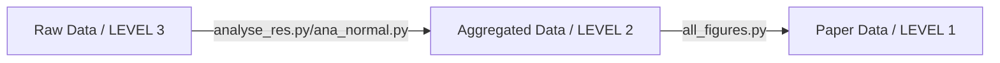

# Introduction
This repository accompanies our paper "How to estimate confluence lazily".
We show how to obtain the in the paper shown results on three levels:
1. LEVEL 1: How to get the plots and tables from specifically for the plotting aggregated data
2. LEVEL 2: How to get the plots and figures from the aggregation of the raw results
3. LEVEL 3: How to aggregate the raw results

The following diagram visualizes the process:



## Requirements
- pip (tested in version 22.0.2)
- Python (tested in version 3.10)

## Installation
- clone this repo
- install the requirements from the `requirements.txt` file in the environment of your choice for example:
```
python -m venv .venv
source .venv/bin/activate
pip install -r requirements.txt
```

## Get figures and tables from LEVEL 1 (recommended)


We've already uploaded the fully prepared and aggregated data to this repo. So the easiest way to get the figures and tables shown in the paper is to run the following scripts:

```
python scripts/tables/tables.py --from-table-data
```

This will generate the following output
```
output/
|-- additional_figures_and_tables
|-- main
|   |-- Table_1_a.csv
|   `-- Table_1_b.csv
`-- supplement
    |-- Table_S1_a.csv
    |-- Table_S1_b.csv
    |-- Table_S2_dAbsAbsConf_min_max_steps.csv
    |-- Table_S3_dAbsAbsConf_min_max_steps.csv
    |-- Table_S4_iou_min_max_steps.csv
    `-- Table_S5_iou_min_max_steps.csv
```

To generate the figures
```
python scripts/figures/all_figures.py --from-figure-data --all-figures
```

This will result in:
```
output/
|-- additional_figures_and_tables
|   |-- Figure_1_no_global_y_axis._p_values.csv
|   |-- Figure_1_no_global_y_axis.png
|   |-- Figure_S1_no_global_y_axis._p_values.csv
|   `-- Figure_S1_no_global_y_axis.png
|-- main
|   |-- Figure_1._p_values.csv
|   |-- Figure_1.png
|   |-- Figure_2.png
|   |-- Figure_2_p_values.csv
|   |-- Figure_3.png
|   |-- Figure_3_p_values.csv
|   `-- Figure_4.png
`-- supplement
    |-- Figure_S1._p_values.csv
    |-- Figure_S1.png
    `-- Figure_S2_iou.png|`output
|-- main
|   |-- Figure_1._p_values.csv
|   `-- Figure_1.png
|-- main_tables
|-- supplement
|   |-- Figure_S1._p_values.csv
|   `-- Figure_S1.png
`-- supplement_tables
```

Note that if you want only to generate a specific figure, use `--figure-<n>` instead of `--all-figures`. This will create the figure and the corresponding supplement figures

## Aggregate raw results (LEVEL 3) and get paper table/figure (LEVEL 2)
To comprehend the data aggregation from the raw results of our experiments to the tables and figures shown in the paper, we provide scripts that download the raw data and run the aggregation.
Running these scripts will download roughly 13GB of data to your machine and may take up to 30 minutes.
To obtain the and aggregate the results of the full training vs zero shot experiments, run the following script:
```
python scripts/aggregate/ana_normal.py
```
To aggregate the raw results of the Active Learning experiments, please run the following scripts:

```
python scripts/aggregate/analyse_res.py
```
This was the final step of LEVEL3 (raw -> aggregation). Now you can also get the tables and figures from this data with:

```
python scripts/tables/tables.py --from-aggregation
```
This script will generate not only the plots and figures, but also the figure and table-specific input data, that we used in LEVEL 1

### Generation of raw results
Please refer to these three repositories for detailed information:
- [Detectron2 and Cellpose](https://git.informatik.uni-leipzig.de/joas/confluence/-/tree/main?ref_type=heads)
- [U-Net](https://git.informatik.uni-leipzig.de/joas/confluence-unet)
- [Segment Anything Model](https://git.informatik.uni-leipzig.de/joas/confluence-sam)
