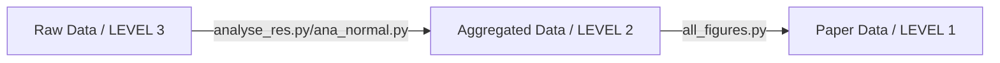

# confluence-paper
This repository accompanies our paper "How to estimate confluence lazily".
We show how to obtain the in the paper shown results on three levels:
1. LEVEL 1: How to get the plots and tables from specifically for the plotting aggregated data
2. LEVEL 2: How to get the plots and figures from the aggregation of the raw results
3. LEVEL 3: How to aggregate the raw results

## Requirements
- pip
- python

## Installation
Install the requirements from the `requirements.txt` file in the environment of your choice for example:
```
python -m venv .venv
source .venv/bin/activate
pip install -r requirements.txt
```

## Get figures and tables from LEVEL 1 (recommended)


We've already uploaded the fully prepared and aggregated data to this very repo. So the easiest way to get the figures and tables shown in the paper is to run the following scripts:
```python scripts/tables/tables.py --from-table-data```
This will generate the following output
```
output/
|-- additional_figures_and_tables
|-- main
|   |-- Table_1_a.csv
|   `-- Table_1_b.csv
`-- supplement
    |-- Table_S1_a.csv
    |-- Table_S1_b.csv
    |-- Table_S2_dAbsAbsConf_min_max_steps.csv
    |-- Table_S3_dAbsAbsConf_min_max_steps.csv
    |-- Table_S4_iou_min_max_steps.csv
    `-- Table_S5_iou_min_max_steps.csv
```

```python scripts/figures/all_figures.py --from-figure-data --all-figures```

This will result in:
```
output/
|-- additional_figures_and_tables
|   |-- Figure_1_no_global_y_axis._p_values.csv
|   |-- Figure_1_no_global_y_axis.png
|   |-- Figure_S1_no_global_y_axis._p_values.csv
|   `-- Figure_S1_no_global_y_axis.png
|-- main
|   |-- Figure_1._p_values.csv
|   |-- Figure_1.png
|   |-- Figure_2.png
|   |-- Figure_2_p_values.csv
|   |-- Figure_3.png
|   |-- Figure_3_p_values.csv
|   `-- Figure_4.png
`-- supplement
    |-- Figure_S1._p_values.csv
    |-- Figure_S1.png
    `-- Figure_S2_iou.png|`output
|-- main
|   |-- Figure_1._p_values.csv
|   `-- Figure_1.png
|-- main_tables
|-- supplement
|   |-- Figure_S1._p_values.csv
|   `-- Figure_S1.png
`-- supplement_tables
```


Note if you want only to generate a specific figure then use `--figure-<n>` instead of `--all-figures`. This will create the figure and the corresponding supplement figures

